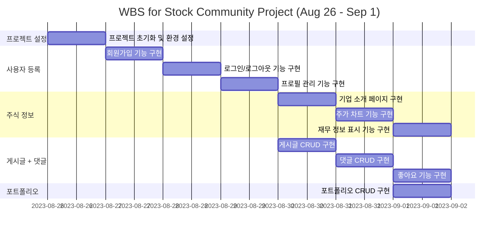
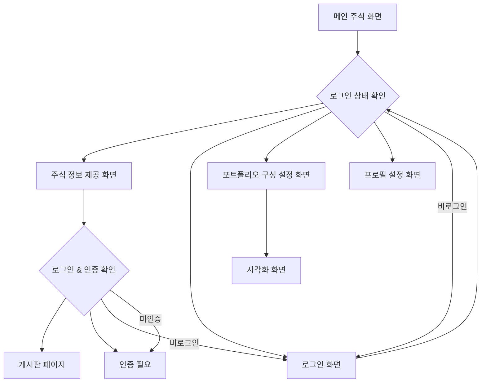
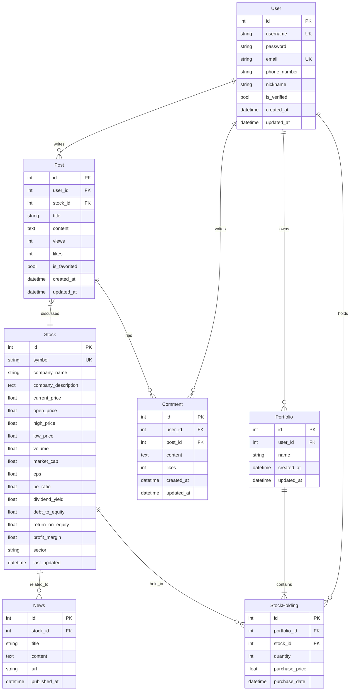

# 스톡(Stalk) 
## 부제: Stock talking 이라는 뜻

**"주식 토론방, 인증된 주주들끼리 기업의 최신 정보를 나누자!"**

**"주식 포트폴리오를 한 눈에 관리하자!"**

## 1. 목표와 기능

1.1 목표
- 넘치는 주식 정보를 한 눈에 깔끔하게 얻자.
- 인증된 주주들의 의견들을 실시간으로 나누자.
- 정보들을 바탕으로 포트폴리오를 구성해보자

1.2 주요 기능
- 주식 정보
    - 주가 차트
    - 재무 정보 (주요 재무제표 and 재무비율)
    - 기업 소개
    - 기업 관련 뉴스(yahoo finance)

- 토론방
    - 글 작성
    - 조회수, 좋아요, 즐겨찾기, 댓글 기능

- 상상(자신만의) 주식 포트폴리오 만들기
    - 포트폴리오 수익률 시각화
    - 포트폴리오 관리


## 2. URL 구조

#### Main URL
| **App** | **URL** | **Views Function** | **HTML File Name** | **Note** |
| -- | -- | -- | -- | -- |
| **stocks** | /stocks/ | stocks_list | stocks/stocks_list.html | 주식 정보 메인 화면 |
| **stocks** | /stocks/company/ | stocks_company | stocks/stocks_company.html | 기업 소개 |
| **stocks** | /stocks/news/ | stocks_news | stocks/stocks_news.html | 기업 관련 뉴스 |
| **stocks** | /stocks/chart/ | stocks_chart | stocks/stocks_chart.html | 주가 차트 |
| **stocks** | /stocks/financials/ | stocks_financials | stocks/stocks_financials.html | 재무 정보 (주요 재무제표 및 재무비율) |

#### Registration URL
| **App** | **URL** | **Views Function** | **HTML File Name** | **Note** |
| -- | -- | -- | -- | -- |
| **accounts** | /accounts/signup/ | accounts_signup | accounts/signup.html | 회원가입 |
| **accounts** | /accounts/login/ | accounts_login | accounts/login.html | 로그인 |
| **accounts** | /accounts/logout/ | accounts_logout |  | 로그아웃 |
| **accounts** | /accounts/profile/ | accounts_profile | accounts/profile.html | 비밀번호 변경, 프로필 수정, 닉네임 추가 |
| **accounts** | /accounts/verify/ | accounts_verify | accounts/verify.html | 주주 인증 |

#### Post URL
| **App** | **URL** | **Views Function** | **HTML File Name** | **Note** |
| -- | -- | -- | -- | -- |
| **forum** | /forum/ | forum_list | forum/forum_list.html | 주주 토론방 메인 화면 |
| **forum** | /forum/posts/ | forum_posts_list | forum/forum_posts_list.html | 게시글 목록 |
| **forum** | /forum/posts/create/ | forum_post_create | forum/forum_post_create.html | 새 게시글 작성 |
| **forum** | /forum/posts/<int:post_id>/ | forum_post_detail | forum/forum_post_detail.html | 개별 게시글 조회/수정/삭제 |
| **forum** | /forum/posts/<int:post_id>/comments/ | forum_comments | forum/forum_comments.html | 댓글 목록 |
| **forum** | /forum/posts/<int:post_id>/comments/create/ | forum_comment_create | forum/forum_comment_create.html | 새 댓글 작성 |
| **forum** | /forum/posts/<int:post_id>/comments/<int:comment_id>/ | forum_comment_detail | forum/forum_comment_detail.html | 개별 댓글 조회/수정/삭제 |

#### Portfolio URL
| **App** | **URL** | **Views Function** | **HTML File Name** | **Note** |
| -- | -- | -- | -- | -- |
| **portfolio** | /portfolio/ | portfolio_list | portfolio/portfolio_list.html | 주식 포트폴리오 메인 화면 |
| **portfolio** | /portfolio/create/ | portfolio_create | portfolio/portfolio_create.html | 새 포트폴리오 생성 |
| **portfolio** | /portfolio/<int:portfolio_id>/ | portfolio_detail | portfolio/portfolio_detail.html개별 포트폴리오 조회/수정/삭제 |
| **portfolio** | /portfolio/<int:portfolio_id>/stocks/ | portfolio_stocks | portfolio/portfolio_stocks.html | 포트폴리오 내 주식 목록 |


## 3. 기능 명세서
1. 사용자 등록 기능
    - 회원가입 : 아이디, 비밀번호, 전화번호, 이메일, 이름, 닉네임
    - 로그인 : 
    - 로그아웃 :
    - 비밀번호 변경, 프로필 수정, 닉네임 추가 :

2. 주식 정보
    - 기업 소개 : 기업 소개 글
    - 기업 관련 뉴스 : Yahoo Finance 뉴스 크롤링, 없을 경우, none 출력 -> 가장 최신 뉴스 1개, 인기 조회수 2개 구현
    - 주가 차트 : 주가 차트 제공 기능 구현
    - 재무 정보 : 기본 재무 정보 + 재무비율 표로 제공

3. 게시글 + 댓글
    - 주주 인증 절차 구현 : how?
    - 게시글 : 좋아요 기능
        - CRUD 
    - 댓글 : 좋아요 기능
        - CRUD 
    - 유효성 검사 : 광고, 악성 글 차단
    
4. 포트폴리오
    - 원 그래프 : 투자 비중 원 그래프 시각화
    - 수익률 : 주식 별 수익률 시각화
    - 포트폴리오 분석 : 변동성, 섹터 비율 등 분석
    - CRUD

| 대분류 | 중분류 | 소분류 | 설명 |
|--------|--------|--------|------|
| 1. 사용자 등록 | 회원가입 | - | 아이디, 비밀번호, 전화번호, 이메일, 닉네임 |
| | 로그인 | - | 등록된 사용자 인증 |
| | 로그아웃 | - | 사용자 세션 종료 |
| | 프로필 관리 | 비밀번호 변경 | 사용자 비밀번호 수정 |
| | | 프로필 수정 | 사용자 프로필 정보 수정 |
| | | 닉네임 추가 | 사용자 닉네임 변경 |
| 2. 주식 정보 | 기업 소개 | - | 기업에 대한 소개글 제공 |
| | 기업 관련 뉴스 | 뉴스 크롤링 | Yahoo Finance에서 최신 뉴스 1개, 인기 뉴스 2개 크롤링 |
| | | 뉴스 표시 | 크롤링한 뉴스 표시, 없을 경우 'none' 출력 |
| | 주가 차트 | - | 주식의 가격 변동 차트 제공 |
| | 재무 정보 | 기본 재무 정보 | 주요 재무 정보 표로 제공 |
| | | 재무 비율 | 주요 재무 비율 표로 제공 |
| 3. 게시글 + 댓글 | 주주 인증 | - | 토론방 접근을 위한 주주 인증 절차 |
| | 게시글 | CRUD | 게시글 생성, 조회, 수정, 삭제 기능 |
| | | 좋아요 | 게시글 좋아요 기능 |
| | 댓글 | CRUD | 댓글 생성, 조회, 수정, 삭제 기능 |
| | | 좋아요 | 댓글 좋아요 기능 |
| | 유효성 검사 | - | 광고, 악성 글 차단 기능 |
| 4. 포트폴리오 | 포트폴리오 관리 | CRUD | 포트폴리오 생성, 조회, 수정, 삭제 기능 |
| | 투자 비중 시각화 | 원 그래프 | 포트폴리오 내 투자 비중을 원 그래프로 시각화 |
| | 수익률 분석 | 주식별 수익률 | 각 주식의 수익률 선 그래프로 시각화 |
| | 포트폴리오 분석 | 변동성 분석 | 포트폴리오의 변동성 분석 |
| | | 섹터 분석 | 포트폴리오의 섹터 비율 분석 |
    

## 4. 프로젝트 구조와 개발 일정

### 4.1 프로젝트 구조

```
stock_community/
│
├── manage.py
├── stock_community/
│   ├── __init__.py
│   ├── settings.py
│   ├── urls.py
│   └── wsgi.py
│
├── stocks/
│   ├── migrations/
│   ├── templates/
│   │   └── stocks/
│   │       ├── stocks_list.html
│   │       ├── stocks_company.html
│   │       ├── stocks_news.html
│   │       ├── stocks_chart.html
│   │       └── stocks_financials.html
│   ├── __init__.py
│   ├── admin.py
│   ├── apps.py
│   ├── models.py
│   ├── tests.py
│   ├── urls.py
│   └── views.py
│
├── accounts/
│   ├── migrations/
│   ├── templates/
│   │   └── accounts/
│   │       ├── signup.html
│   │       ├── login.html
│   │       ├── profile.html
│   │       └── verify.html
│   ├── __init__.py
│   ├── admin.py
│   ├── apps.py
│   ├── models.py
│   ├── tests.py
│   ├── urls.py
│   └── views.py
│
├── forum/
│   ├── migrations/
│   ├── templates/
│   │   └── forum/
│   │       ├── forum_list.html
│   │       ├── forum_posts_list.html
│   │       ├── forum_post_create.html
│   │       ├── forum_post_detail.html
│   │       ├── forum_comments.html
│   │       ├── forum_comment_create.html
│   │       └── forum_comment_detail.html
│   ├── __init__.py
│   ├── admin.py
│   ├── apps.py
│   ├── models.py
│   ├── tests.py
│   ├── urls.py
│   └── views.py
│
└── portfolio/
    ├── migrations/
    ├── templates/
    │   └── portfolio/
    │       ├── portfolio_list.html
    │       ├── portfolio_create.html
    │       ├── portfolio_detail.html
    │       └── portfolio_stocks.html
    ├── __init__.py
    ├── admin.py
    ├── apps.py
    ├── models.py
    ├── tests.py
    ├── urls.py
    └── views.py
```


### 4.2 개발 일정(WBS)



## 5 화면 설계

### 5.1 앱 화면 flow



### 5.2 앱 화면


## 6. 데이터베이스 구조도(ERD)



## 7. 구현 영상