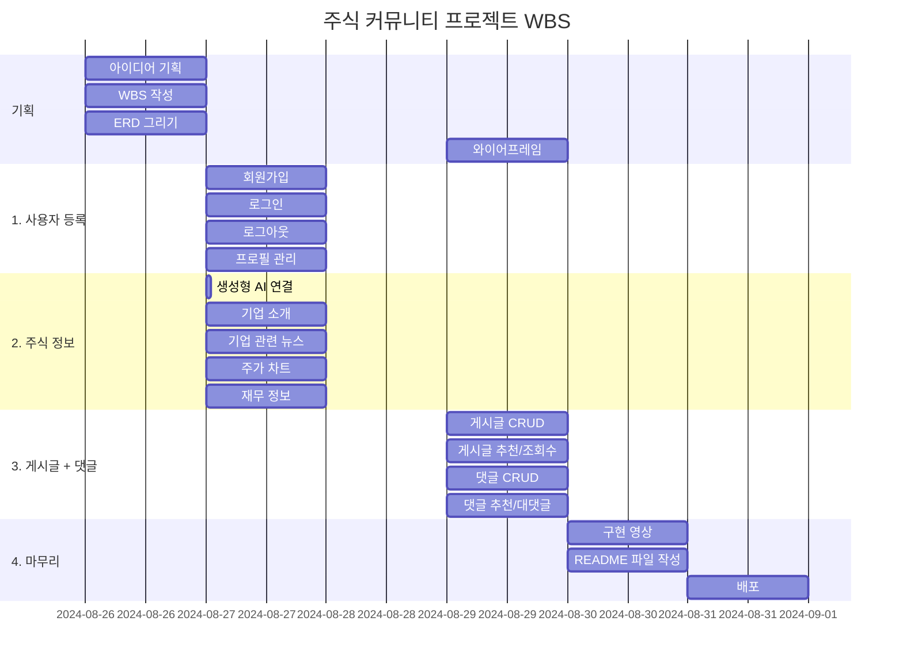
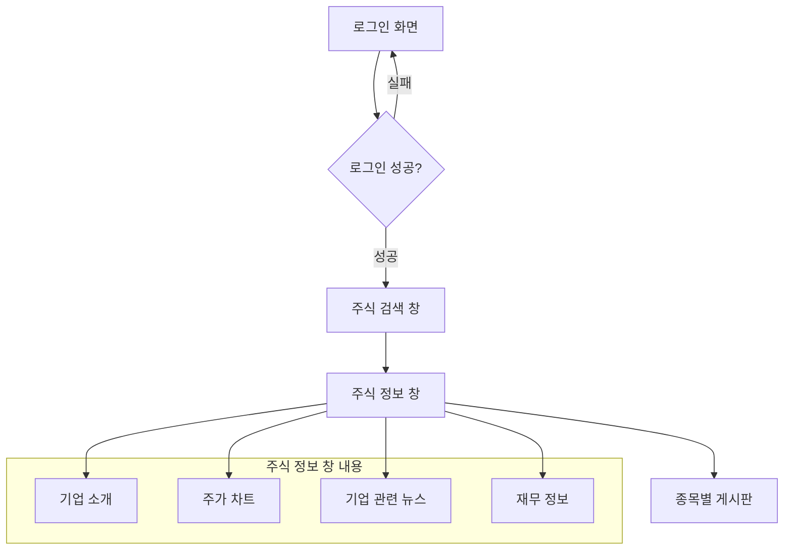
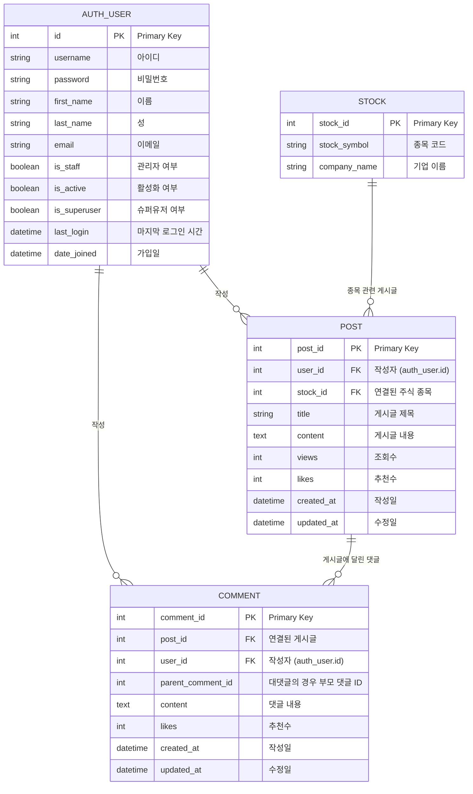

# 스톡(Stalk) 

## 1. 목표와 기능

1.1 목표
- 주식 투자를 위한 기본적인 기업 정보 제공
- 기업별로 사용자들끼리 블로그 형식의 정보 공유 공간 제공

1.2 주요 기능
- 주식 정보
    - 주가 차트
    - 재무 정보 (주요 재무제표 and 재무비율)
    - 기업 소개
    - 기업 관련 뉴스(yahoo finance)

- 토론방
    - 글 작성
    - 조회수, 추천, 즐겨찾기, 댓글 기능


## 2. URL 구조

#### Main URL
| **App** | **URL** | **Views Function** | **HTML File Name** | **Note** |
| -- | -- | -- | -- | -- |
| **Main** | / | Main_view | base.html | 메인 페이지 |


#### Stocks URL
| **App** | **URL** | **Views Function** | **HTML File Name** | **Note** |
| -- | -- | -- | -- | -- |
| **stocks** | /stocks/search/ | stocks_search | stocks/stocks_search.html | 주식 검색 창 |
| **stocks** | /stocks/str:symbol/ | stocks_intro | stocks/stocks_intro.html | 주식 소개 글 |
| **stocks** | /stocks/str:symbol/news/ | stocks_news | stocks/stocks_news.html | 기업 관련 뉴스 |
| **stocks** | /stocks/str:symbol/chart/ | stocks_chart | stocks/stocks_chart.html | 주가 차트 |
| **stocks** | /stocks/str:symbol/financials/ | stocks_financials | stocks/stocks_financials.html | 기업 재무 정보 |

#### Accounts URL
| **App** | **URL** | **Views Function** | **HTML File Name** | **Note** |
| -- | -- | -- | -- | -- |
| **accounts** | /accounts/signup/ | accounts_signup | accounts/signup.html | 회원가입 |
| **accounts** | /accounts/login/ | accounts_login | accounts/login.html | 로그인 |
| **accounts** | /accounts/profile/ | accounts_profile | accounts/profile.html | 프로필 설정 |

#### Forum URL
| **App** | **URL** | **Views Function** | **HTML File Name** | **Note** |
| -- | -- | -- | -- | -- |
| **forum** | /forum/ | forum_main | forum/forum_main.html | 주주 토론방 메인 |
| **forum** | /forum/list/ | forum_list | forum/forum_list.html | 글 리스트 |
| **forum** | /forum/create/ | post_create | forum/post_create.html | 글 작성 |
| **forum** | /forum/int:post_id/ | post_read | forum/post_read.html | 글 읽기 |
| **forum** | /forum/int:post_id/detail/ | post_detail | forum/post_detail.html | 글 추천, 조회수 |
| **forum** | /forum/int:post_id/update/ | post_update | forum/post_update.html | 글 수정 |
| **forum** | /forum/int:post_id/delete/ | post_delete | forum/post_delete.html | 글 삭제 |
| **forum** | /forum/int:post_id/comments/ | post_comment_list | forum/post_comment_list.html | 댓글 리스트 |
| **forum** | /forum/int:post_id/comments/create/ | post_comment_create | forum/post_comment_create.html | 댓글/대댓글 작성 |
| **forum** | /forum/int:post_id/comments/int:comment_id/ | post_comment_detail | forum/post_comment_detail.html | 댓글 수정/삭제 |


## 3. 기능 명세서
1. 사용자 등록 기능
    - 회원가입 : 아이디, 비밀번호, 이름, 이메일
    - 로그인
    - 사용자 정보 변경

2. 주식 정보
    - 기업 소개 : 기업 소개 글
    - 기업 관련 뉴스 : Yahoo Finance 뉴스 크롤링
    - 주가 차트 : 주가 차트 제공 기능 구현
    - 재무 정보 : 기본 재무 정보 + 재무비율 표로 제공

3. 게시글 + 댓글
    - 게시글
        - CRUD
        - 추천, 조회수 
    - 댓글
        - CRUD
        - 추천
        - 대댓글 작성
    - 유효성 검사 : 광고, 악성 글 차단
    

| 대분류 | 중분류 | 소분류 | 설명 | 완성 여부 |
|--------|--------|--------|------| :--: |
| 기획 | 아이디어 기획 | - | 핵심 기능 설계 | ㅇ |
| | WBS 작성 | - | mermaid로 프로젝트 단계 세분화 | ㅇ |
| | ERD 그리기 | - | DB, 앱 flow 그리기 | ㅇ |
| | 와이어프레임 | - | 앱 UI 설계 및 그리기 | |
| 1. 사용자 등록 | 회원가입 | 기본 | 아이디, 비밀번호, 이름, 이메일 | ㅇ |
| | 로그인 | - | 로그인 기능 | ㅇ |
| | 로그아웃 | - | 사용자 세션 종료 | ㅇ |
| | 프로필 관리 | | 사용자 프로필 수정 | ㅇ |
| 2. 주식 정보 | openapi | - | 기업 이름 검색 -> ticker 변경 | |
| | 기업 소개 | - | 기업에 대한 소개글 제공 | |
| | 기업 관련 뉴스 | 뉴스 크롤링 | Yahoo Finance에서 최신 뉴스 1개, 인기 뉴스 2개 크롤링 | |
| | | 뉴스 표시 | 크롤링한 뉴스 표시, 없을 경우 'none' 출력 | |
| | 주가 차트 | - | 주식의 가격 변동 차트 제공 | |
| | 재무 정보 | 기본 재무 정보 | 주요 재무 정보 표로 제공 | |
| | | 재무 비율 | 주요 재무 비율 표로 제공 | |
| 3. 게시글 + 댓글 | 게시글 | CRUD | 게시글 생성, 조회, 수정, 삭제 기능 | |
| | | 추천 | 게시글 추천 기능 | |
| | | 조회수 | 게시글 조회수 기능 | |
| | | 유효성 검사 | 광고, 악성 글 차단 | |
| | 댓글 | CRUD | 댓글 생성, 조회, 수정, 삭제 | |
| | | 추천 | 댓글 추천 | |
| | | 대댓글 | 댓글 밑 대댓글 | |
| 4. 마무리 | 구현 영상 | - | - | |
| | README 파일 작성 | - | - | |
| | 배포 | - | - | |
    

## 4. 프로젝트 구조와 개발 일정

### 4.1 프로젝트 구조

```
stock_community/
│
├── manage.py
├── templates/
│   │   ├── stocks/
│   │   |   ├── stocks_search.html  # 주식 검색 창
│   │   |   ├── stocks_intro.html   # 주식 소개 글
│   │   |   ├── stocks_news.html    # 기업 관련 뉴스
│   │   |   ├── stocks_chart.html   # 주가 차트
│   │   |   └── stocks_financials.html  # 기업 재무 정보
|   |   |
│   │   ├── accounts/
│   │   │   ├── signup.html    # 회원가입
│   │   │   ├── login.html     # 로그인
│   │   │   ├── profile.html   # 프로필 설정
│   │   │   └── edit_profile.html   # 프로필 수정
│   │   │
|   │   └── forum/
|   │       ├── forum_main.html       # 글 조회
|   │       ├── forum_list.html       # 글 리스트
|   │       ├── post_create.html      # 글 작성
|   │       ├── post_read.html        # 글 읽기
|   │       ├── post_update.html      # 글 수정
|   │       ├── post_delete.html      # 글 삭제
|   │       ├── post_detail.html      # 글 추천, 조회수
|   │       ├── post_comment_list.html     # 댓글 리스트
|   │       ├── post_comment_create.html   # 댓글/대댓글 작성
|   │       └── post_comment_detail.html   # 댓글 수정/삭제
|   |
│   └── base.html   # 기본 템플릿
|
├── stock_community/
│   ├── __init__.py
│   ├── asgi.py
│   ├── settings.py
│   ├── urls.py
│   └── wsgi.py
│
├── stocks/
│   ├── migrations/
│   ├── __init__.py
│   ├── admin.py
│   ├── apps.py
│   ├── models.py
│   ├── tests.py
│   ├── urls.py
│   └── views.py
│
├── accounts/
│   ├── migrations/
│   ├── __init__.py
│   ├── admin.py
│   ├── apps.py
|   ├── forms.py
│   ├── models.py
│   ├── tests.py
│   ├── urls.py
│   └── views.py
│
└── forum/
    ├── migrations/
    ├── __init__.py
    ├── admin.py
    ├── apps.py
    ├── models.py
    ├── tests.py
    ├── urls.py
    └── views.py
```


### 4.2 개발 일정(WBS)



## 5 화면 설계

### 5.1 화면 flow



### 5.2 와이어프레임


## 6. 데이터베이스 구조도(ERD)




## 7. 구현 영상