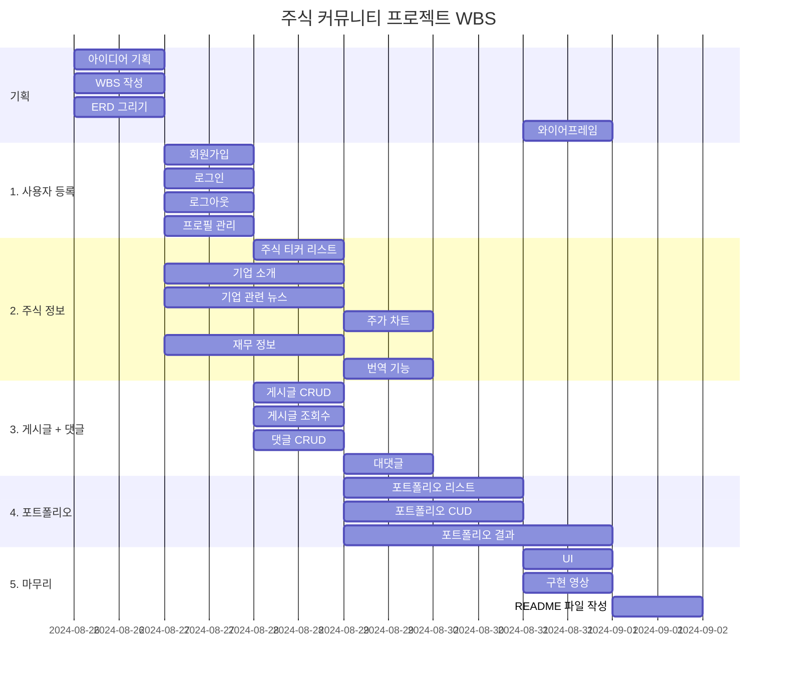

# 스톡(Stalk) 

## 1. 목표와 기능

1.1 목표
- 미국 주식 투자를 위한 기업 정보 제공
- 기업별(미국에 상장된)로 사용자들끼리 게시판 형식의 정보 공유 공간 제공
- 주식 포트폴리오 만들기

1.2 주요 기능
- 주식 정보(yfinance)
    - 기업 소개
    - 주가 차트
    - 기업 관련 뉴스
    - 재무 정보

- 토론방
    - 글 작성
    - 조회수, 댓글 기능

- 포트폴리오
    - 포트폴리오 생성
    - 포트폴리오 수익률

## 2. URL 구조

#### Main URL
| **App** | **URL** | **Views Function** | **HTML File Name** | **Note** |
| -- | -- | -- | -- | -- |
| **Main** | / | Index_view | base.html | 메인 페이지 |

#### Stocks URL
| **App** | **URL** | **Views Function** | **HTML File Name** | **Note** |
| -- | -- | -- | -- | -- |
| **stocks** | /stocks/search/ | search | stocks/stocks_search.html | 주식 검색 창 |
| **stocks** | /stocks/detail/str:pk/ | detail | stocks/stocks_detail.html | 주식 소개 글, 차트, 뉴스, 재무정보 |

#### Accounts URL
| **App** | **URL** | **Views Function** | **HTML File Name** | **Note** |
| -- | -- | -- | -- | -- |
| **accounts** | /accounts/signup/ | signup | accounts/signup.html | 회원가입 |
| **accounts** | /accounts/login/ | login | accounts/login.html | 로그인 |
| **accounts** | /accounts/logout/ | logout | | 로그아웃 |
| **accounts** | /accounts/profile/ | profile | accounts/profile.html | 프로필 설정 |
| **accounts** | /accounts/profile/edit/ | edit_profile | accounts/edit_profile.html | 프로필 수정 |

#### Forum URL
| **App** | **URL** | **Views Function** | **HTML File Name** | **Note** |
| -- | -- | -- | -- | -- |
| **forum** | /forum/str:ticker/ | forum_list | forum/forum_list.html | 글 리스트 |
| **forum** | /forum/str:ticker/create/ | post_create | forum/post_create.html | 글 작성 |
| **forum** | /forum/str:ticker/int:post_id/ | post_read | forum/post_read.html | 글 읽기, 댓글 작성 |
| **forum** | /forum/str:ticker/int:post_id/update/ | post_update | forum/post_update.html | 글 수정 |
| **forum** | /forum/str:ticker/int:post_id/delete/ | post_delete | forum/post_delete.html | 글 삭제 |
| **forum** | /forum/str:ticker/int:post_id/comments/ | post_comment_list | forum/post_comment_list.html | 댓글 리스트 |
| **forum** | /forum/str:ticker/int:post_id/comments/int:comment_id/update | post_comment_update | forum/post_comment_update.html | 댓글 수정 |
| **forum** | /forum/str:ticker/int:post_id/comments/int:comment_id/delete | post_comment_delete | forum/post_comment_delete.html | 댓글 삭제 |

#### Portfolio URL
| **App** | **URL** | **Views Function** | **HTML File Name** | **Note** |
| -- | -- | -- | -- | -- |
| **portfolio** | /portfolio/list/ | portfolio_list | portfolio/portfolio_list.html | 포트폴리오 리스트 |
| **portfolio** | /portfolio/create/ | portfolio_create | portfolio/portfolio_create.html | 포트폴리오 만들기 |
| **portfolio** | /portfolio/int:pk/ | portfolio_read | portfolio/portfolio_read.html | 포트폴리오 결과 |
| **portfolio** | /portfolio/delete/int:pk/ | portfolio_delete | portfolio/portfolio_delete.html | 포트폴리오 삭제 |


## 3. 기능 명세서
1. 사용자 등록 기능
    - 회원가입 : 아이디, 비밀번호
    - 로그인
    - 사용자 정보 변경

2. 주식 정보
    - 기업 소개
    - 기업 관련 뉴스
    - 주가 차트
    - 재무 정보

3. 게시글 + 댓글
    - 게시글
        - CRUD
        - 사진 첨부 기능
        - 조회수

    - 댓글
        - CRUD
        - 대댓글(답글)

4. 포트폴리오
    - 나의 주식 포트폴리오
        - CRD
        - 포트폴리오 수익률
    

## 4. 프로젝트 구조와 개발 일정

### 4.1 프로젝트 구조

```
stock_community/
│
├── manage.py
├── templates/
│   │   ├── stocks/
│   │   |   ├── stocks_search.html  # 주식 검색 창
│   │   |   └── stocks_detail.html  # 기업 소개 글, 뉴스, 차트, 재무 정보
|   |   |
│   │   ├── accounts/
│   │   │   ├── signup.html    # 회원가입
│   │   │   ├── login.html     # 로그인
│   │   │   ├── profile.html   # 프로필 설정
│   │   │   └── edit_profile.html   # 프로필 수정
│   │   │
|   │   ├── forum/
|   │   │   ├── forum_list.html       # 글 리스트
|   │   │   ├── post_create.html      # 글 작성
|   │   │   ├── post_read.html        # 글 읽기, 댓글 작성
|   │   │   ├── post_update.html      # 글 수정
|   │   │   ├── post_delete.html      # 글 삭제
|   │   │   ├── post_comment_list.html     # 댓글 리스트
|   │   │   ├── post_comment_update.html   # 댓글 수정
|   |   │   └── post_comment_delete.html   # 댓글 삭제
|   |   │
│   │   └── portfolio/
│   │       ├── portfolio_list.html    # 포트폴리오 리스트
│   │       ├── portfolio_create.html    # 포트폴리오 생성
│   │       ├── portfolio_read.html     # 포트폴리오 결과
│   │       └── portfolio_delete.html   # 포트폴리오 삭제
│   │
│   └── base.html   # 기본 템플릿
|
├── stock_community/
│   ├── __init__.py
│   ├── asgi.py
│   ├── settings.py
│   ├── urls.py
│   ├── views.py
│   └── wsgi.py
│
├── stocks/
│   ├── management/
│   |   └── commands/
|   |       └── imports_stocks.py
│   ├── migrations/
|   |   ├── __init__.py
|   |   └── 0001_initial.py
│   ├── __init__.py
│   ├── admin.py
│   ├── apps.py
│   ├── models.py
│   ├── tests.py
│   ├── urls.py
│   └── views.py
│
├── accounts/
│   ├── migrations/
|   |   └── __init__.py
│   ├── __init__.py
│   ├── admin.py
│   ├── apps.py
|   ├── forms.py
│   ├── models.py
│   ├── tests.py
│   ├── urls.py
│   └── views.py
│
├── forum/
│   ├── migrations/
│   |   ├── __init__.py
│   |   ├── 0001_initial.py
│   |   ├── 0002_post_image.py
|   |   └── 0003_comment_parent.py
│   ├── __init__.py
│   ├── admin.py
│   ├── apps.py
│   ├── forms.py
│   ├── models.py
│   ├── tests.py
│   ├── urls.py
│   └── views.py
│
└── portfolio/
    ├── migrations/
    |   ├── __init__.py
    |   └── 0001_initial.py
    ├── __init__.py
    ├── admin.py
    ├── apps.py
    ├── forms.py
    ├── models.py
    ├── tests.py
    ├── urls.py
    └── views.py
```


### 4.2 개발 일정(WBS)



## 5 화면 설계

### 5.1 화면 flow


### 5.2 와이어프레임

#### Main


#### stock


#### profile


#### portfolio


## 6. 데이터베이스 구조도(ERD)


## 7. 구현 영상

#### 회원가입 & 로그인


#### 프로필


#### 주식 정보


#### 게시판


#### 포트폴리오


